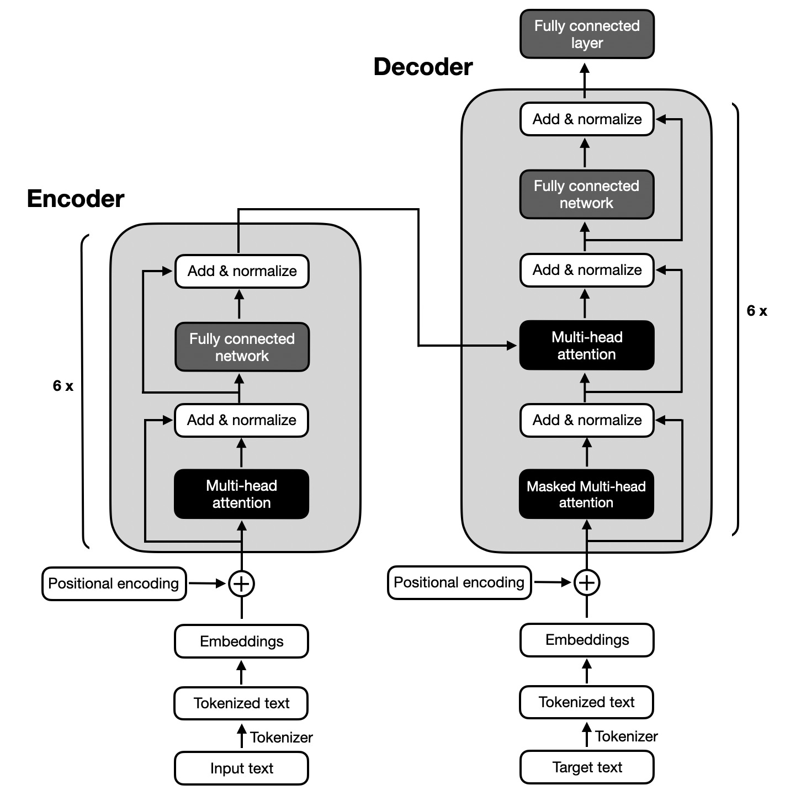
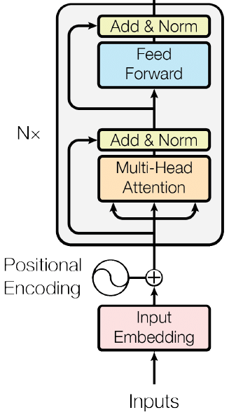
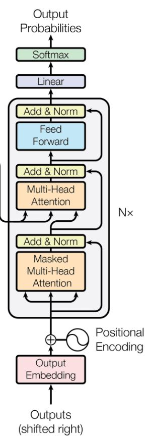
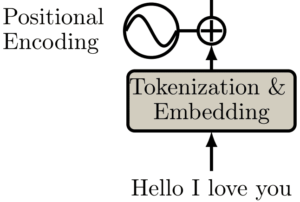

# Transformers em Profundidade: Uma Exploração Matemática e Aplicações em Processamento de Linguagem Natural

## 1. Introdução

Desde sua introdução pelo Google em 2017, a arquitetura de Transformers tem sido um divisor de águas no campo do Processamento de Linguagem Natural (PLN). A
tecnologia dos Transformers, descrita em [4], superou as limitações das Redes Neurais Recorrentes (RNNs) e das Long Short-Term Memory networks (LSTMs) principalmente
na capacidade de processar dependências de longo alcance e na mitigação do fenômeno de esquecimento. Esta inovação foi crucial para avanços significativos em tarefas complexas
de PLN, como a tradução automática e a interpretação de texto.

A essência revolucionária dos Transformers reside em seu mecanismo de atenção, uma abordagem inovadora que se afasta do processamento sequencial característico das
RNNs e LSTMs. Essa abordagem paralela não só facilita a detecção de dependências em sequências longas, mas também melhora significativamente a eficiência do processamento
de dados. Com a capacidade de processar várias partes da entrada simultaneamente, os Transformers conseguem identificar padrões complexos com maior eficácia, como exemplificado pelo BERT (Bidirectional Encoder Representations from Transformers) [2], um marco no entendimento contextual de textos.

## 2. Aspectos Avançados dos Transformers

### 2.1 Capacidade de Processar Dependências de Longo Alcance

Os Transformers apresentam uma capacidade excepcional de entender e relacionar elementos distantes em um texto. Esta habilidade é crucial em PLN, pois a compreensão
do contexto e a coerência dependem frequentemente de dependências de longo alcance. Diferentemente das RNNs e LSTMs, que enfrentam o desafio de desvanecimento do gradiente e têm dificuldades em manter a relevância de informações anteriores, os Transformers superam isso com seu mecanismo de atenção, permitindo a análise simultânea de todas as partes da sequência.

### 2.2 Mitigação do Fenômeno de Esquecimento

Um desafio comum em modelos sequenciais como RNNs e LSTMs é o esquecimento de informações anteriores em sequências longas. Os Transformers resolvem esse
problema com seu mecanismo de atenção global, onde cada palavra é avaliada em relação a todas as outras no mesmo passo de processamento. Isso permite que o modelo mantenha
um contexto completo da sequência, independentemente do seu comprimento, resultando em uma representação de texto mais rica e precisa.

## 3. Componentes Principais do Transformer

A arquitetura do Transformer é notável pela sua capacidade de processar sequências de dados de forma paralela, capturando dependências complexas a curto e longo prazo [4]. Esta seção detalha a funcionalidade prática e matemática de cada componente nos módulos do Codificador e do Decodificador.

<strong>Figura 1. Arquitetura do Transformer: Codificador e Decodificador</strong> 

### 3.1 O Codificador

O Codificador do Transformer é composto por múltiplas camadas empilhadas, cada uma contribuindo para a complexidade da representação dos dados. As camadas são
constituídas por um mecanismo de atenção multi-cabeça e uma subcamada feedforward
neural network. Após cada uma dessas subcamadas, uma conexão residual é aplicada,
seguida por uma normalização de camada. Este processo de Add & Normalize ajuda
a evitar o problema do desvanecimento do gradiente e mantém a estabilidade durante
o treinamento, contribuindo significativamente para a eficácia do modelo em processar
sequências complexas.

 
<strong>Figura 2. Encoder (Codificador)</strong> 

#### 3.1.1. Atenção Multi-Cabeça

A atenção multi-cabeça, essencial ao Codificador, permite que o modelo atribua
pesos variados às diferentes partes da sequência de entrada. Este mecanismo é crucial
para entender as relações e a importância contextual entre os elementos da sequência. A
atenção é calculada por:

$$\text{Attention}(Q, K, V) = \text{softmax}\left(\frac{QK^T}{\sqrt{d_k}}\right)V$$

onde $Q, K, V$ representam as matrizes de query, chave e valor, respectivamente, e $d_k$ é a dimensão da chave. A execução em paralelo da atenção multi-cabeça permite análises variadas e complementares da entrada.

#### 3.1.2 Rede Neural Feedforward

Cada camada do Codificador inclui uma subcamada feedforward neural network após o mecanismo de atenção. Esta subcamada aplica uma transformação não-linear, essencial para modelar relações complexas. A função feedforward é expressa por:

$$\text{FFN}(x) = \text{ReLU}(0, xW_1 + b_1)W_2 + b_2$$

com $W_1, W_2$ sendo matrizes de peso e $b_1, b_2$ vetores de bias. Esta camada processa cada posição na sequência de entrada independentemente, mantendo o paralelismo característico dos Transformers.

#### 3.1.3 Conexões Residuais e Normalização de Camada

Além dos mecanismos de atenção e redes feedforward, o Codificador do Transformer incorpora conexões residuais e normalização de camada após cada subcamada. As
conexões residuais permitem que a saída de cada subcamada seja somada à sua entrada,
facilitando a propagação do gradiente e ajudando a evitar o desaparecimento do gradiente
em redes profundas [3]. A normalização de camada, aplicada após cada conexão residual,
normaliza a saída para ter média zero e variação unitária, contribuindo para a estabilidade e eficiência do treinamento [1].

### 3.2 O Decodificador

O Decodificador, funcionando em paralelo ao Codificador, utiliza suas camadas
para transformar a representação abstrata em uma saída sequencial coerente. Ele inclui
uma atenção multi-cabeça masked, uma atenção Encoder-Decoder e uma subcamada feedforward neural network em cada camada.

 
<strong>Figura 3. Decodificador</strong> 

#### 3.2.1. Atenção Multi-Cabeça Masked

No Decodificador, a atenção multi-cabeça é adaptada para ser ’masked’, evitando
a influência de posições futuras na geração atual da sequência, um aspecto vital para a
geração autoregressiva de texto. A máscara é tipicamente implementada como uma matriz triangular superior com valores negativos infinitos, resultando em zeros após a aplicação
da softmax. A atenção masked é formulada como:

$$\text{MaskedAttention}(Q, K, V) = \text{softmax}\left(\frac{QK^T}{\sqrt{d_k}} + M\right)V$$

onde $M$ é uma matriz que impõe a mask, garantindo que apenas informações passadas e presentes sejam consideradas.

#### 3.2.2. Atenção Encoder-Decoder

A atenção Encoder-Decoder no Decodificador foca nas partes relevantes da saída do Codificador, facilitando a integração do contexto fornecido pelo Codificador na geração da sequência de saída. Esta atenção é descrita por:

$$\text{EncDecAttention}(Q, K, V) = \text{softmax}\left(\frac{QK^T}{\sqrt{d_k}}\right)V$$

onde $Q$ origina-se do Decodificador e $K, V$ vêm do Codificador, estabelecendo uma conexão direta e efetiva entre os dois módulos. Este mecanismo facilita a transferência de informação e compreensão contextual durante a geração de texto.

#### 3.2.3. Conexões Residuais e Normalização de Camada

Assim como no Codificador, o Decodificador também implementa conexões re-
siduais e normalização de camada após cada subcamada. As conexões residuais ajudam
a evitar o problema do desaparecimento do gradiente em redes profundas, enquanto a
normalização de camada contribui para a estabilidade e eficiência do treinamento [3, 1].

## 4. Processamento de Entrada

O processamento inicial das entradas na arquitetura Transformer é um passo vital,
envolvendo a conversão das palavras ou tokens de entrada em representações numéricas
densas, complementadas com informações posicionais [4]. Essas etapas preparam os
dados para o processamento eficiente pelas camadas do Codificador e Decodificador.

### 4.1 Incorporação de Entrada (Input Embedding)

A etapa de incorporação de entrada é essencial para mapear os tokens de entrada em vetores numéricos de alta dimensão, capturando características semânticas e sintáticas importantes. Considerando $V$ como o tamanho do vocabulário e $d_{\text{model}}$ como a dimensão dos vetores de incorporação, a matriz de incorporação $E$, com dimensões $V \times d_{\text{model}}$, transforma um token $x_i$ em seu vetor correspondente:

$$\text{Embed}(x_i) = E_{i},$$

onde $E_{i}$ é a $i-ésima$ linha da matriz $E$. Esses vetores são otimizados durante o treinamento, refletindo efetivamente as propriedades linguísticas dos tokens.

### 4.2 Codificação Posicional (Positional Encoding)

Devido à abordagem não-sequencial do processamento no Transformer, a Codificação Posicional é empregada para incutir a noção de ordem dos tokens. Utilizando funções senoidais com frequências variadas, esta codificação adiciona uma dimensão temporal aos vetores de incorporação:

$$\text{PE}_{(pos, 2i)} = \sin\left(\frac{pos}{10000^{2i/d_{\text{model}}}}\right)$$

$$\text{PE}_{(pos, 2i+1)} = \cos\left(\frac{pos}{10000^{2i/d_{\text{model}}}}\right)$$

onde $pos$ representa a posição do token na sequência, e $i$ a dimensão correspondente. A escolha dessas funções senoidais facilita a identificação e aprendizado de relações de distância entre tokens pelo modelo.

A combinação da incorporação de entrada com a codificação posicional cria uma representação robusta, rica em detalhes semânticos e posicionais. Este processo é fundamental para o sucesso do Transformer em tarefas de PLN, nas quais a contextualização e ordenação dos tokens são essenciais.

 
<strong>Figura 4. Codificação Posicional</strong> 

## 5. Fluxo de Dados no Codificador

O Codificador do Transformer desempenha um papel crucial na transformação
dos dados de entrada em representações abstratas, que são posteriormente utilizadas pelo
Decodificador [4]. Este processo é realizado por meio de múltiplas camadas de atenção multi-cabeça e redes neurais feedforward, enriquecendo a capacidade do modelo de
discernir relações intrínsecas nos dados.

### 5.1 Entrada para o Codificador

O Codificador recebe a sequência de entrada processada por técnicas de incorporação de entrada e codificação posicional. A matriz $X$ resultante deste pré-processamento contém linhas que representam vetores unificados de incorporação de palavras e codificação posicional.

### 5.2 Atenção Multi-Cabeça no Codificador

No cerne de cada camada do Codificador está o mecanismo de atenção multi-cabeça, que permite ao modelo concentrar-se em diferentes segmentos da sequência de entrada. Para cada cabeça de atenção $i$, a atenção é calculada da seguinte maneira:

$$\text{Head}_i = \text{Attention}(XW_i^Q, XW_i^K, XW_i^V)$$

com as matrizes de peso $W_i^Q, W_i^K, W_i^V$ sendo exclusivas para cada cabeça. As atenções de todas as cabeças são combinadas e transformadas para gerar a saída da camada de atenção multi-cabeça:

$$\text{MultiHead}(X) = \text{Concat}(\text{Head}_1, \text{Head}_2, ..., \text{Head}_h)W^O$$

onde $h$ representa o número total de cabeças de atenção e $W^O$ é uma matriz de peso adicional.

 
<strong>Figura 5. Atenção Multi-Cabeça</strong> 

### 5.3 Rede Neural Feedforward no Codificador

Seguindo a atenção multi-cabeça, cada camada do Codificador possui uma rede neural feedforward. Esta rede executa duas transformações lineares com uma ativação ReLU intermediária:

$$\text{FFN}(x) = \text{max}(0, xW_1 + b_1)W_2 + b_2$$

onde $W_1, W_2$ são matrizes de peso e $b_1, b_2$ vetores de bias. Esta camada adiciona uma dimensão adicional de processamento, capturando relações complexas nos dados.

### 5.4 Conexões Residuais e Normalização de Camada

Cada subcamada do Codificador, incluindo as de atenção e feedforward, incorpora uma conexão residual seguida de normalização de camada. A saída final de cada subcamada é:

$$\text{Output}(x) = \text{LayerNorm}(x + \text{Sublayer}(x))$$

onde $\text{Sublayer}(x)$ representa a operação realizada pela subcamada. Esta estratégia é crucial para prevenir o desaparecimento do gradiente em redes profundas e promove uma aprendizagem mais estável.

Através dessas camadas, o Codificador eficientemente processa os dados de entrada, captando tanto as características únicas de cada palavra quanto as relações contextuais entre elas, criando assim uma representação sofisticada para uso pelo Decodificador.

## 6. Saída do Transformer

Após o processamento dos dados pelo Codificador e sua subsequente transformação pelo Decodificador, o Transformer emprega uma camada linear seguida de uma função softmax para gerar a saída final [4]. Este estágio converte a representação abstrata do Decodificador em probabilidades definidas para cada token no vocabulário de saída.

### 6.1 Camada Linear e Softmax

A saída do Decodificador é inicialmente passada por uma camada linear, mapeando a representação de alta dimensão para o espaço do vocabulário de saída. Se $d_{\text{model}}$ é a dimensão da saída do Decodificador e $V$ o tamanho do vocabulário, a transformação linear é expressa por:

$$Z = XW + b$$

onde $X$ representa a saída do Decodificador, $W$ é a matriz de pesos de dimensões $d_{\text{model}} \times V$, e $b$ é um vetor de bias. Cada linha de $Z$ corresponde à pontuação de cada palavra no vocabulário.

A função softmax é então aplicada para converter estas pontuações em probabilidades:

$$\text{Softmax}(z_i) = \frac{e^{z_i}}{\sum_{j} e^{z_j}}$$

onde $z_i$ é a pontuação da $i$-ésima palavra. A softmax assegura que as probabilidades de todas as palavras somem 1, formando uma distribuição de probabilidade sobre o vocabulário.

### 6.2 Probabilidades de Saída

Com a combinação da transformação linear e a função softmax, o Transformer atribui probabilidades a cada token potencial de saída. O modelo seleciona o token de maior probabilidade em cada passo da sequência de saída, continuando até que um token de finalização seja gerado ou um limite de comprimento de sequência seja atingido.

Esta abordagem probabilística capacita o Transformer a gerar texto de maneira coerente e contextualmente relevante, considerando não apenas a informação mais provável, mas também a variedade de possíveis outputs dados o contexto processado pelo Codificador e Decodificador.

## Referências

[1] Jimmy Lei Ba, Jamie Ryan Kiros e Geoffrey E Hinton. “Layer normalization”. Em:
arXiv preprint arXiv:1607.06450 (2016).

[2] Jacob Devlin et al. “BERT: Pre-training of Deep Bidirectional Transformers for Lan-
guage Understanding”. Em: arXiv preprint arXiv:1810.04805 (2018).

[3] Kaiming He et al. “Deep residual learning for image recognition”. Em: Proceedings
of the IEEE conference on computer vision and pattern recognition (2016), pp. 770–
778.

[4] Ashish Vaswani et al. “Attention is all you need”. Em: Advances in neural informa-
tion processing systems 30 (2017).

